# UTS Pemrograman Mobile - DIKΛ

**Nama:** Riandika Fildani  
**NIM:** 152023062  
**Kelas:** AA  
**Mata Kuliah:** Pemrograman Mobile

---

## 📱 Deskripsi Aplikasi

**DIKΛ** adalah aplikasi Android yang dikembangkan menggunakan **Kotlin** dan **Jetpack Compose** sebagai bagian dari Ujian Tengah Semester mata kuliah Pemrograman Mobile. Aplikasi ini menampilkan berbagai fitur interaktif dengan antarmuka yang modern dan responsif.

### Fitur Utama:
1. **Splash Screen** - Tampilan awal dengan animasi menarik (durasi 5 detik)
2. **Berita** - Menampilkan list berita dengan fitur pencarian dan detail
3. **Cuaca** - Informasi cuaca terkini dengan prakiraan mingguan
4. **Kalkulator** - Kalkulator fungsional untuk operasi matematika dasar
5. **Kontak** - Daftar kontak dengan fitur pencarian dan detail lengkap
6. **Biodata** - Profil pribadi dengan mode view dan edit

---

## 🎯 YANG DI KERJAKAN

### 1. Splash Screen
✅ Splash screen dengan durasi **5 detik**  
✅ Menampilkan **nama aplikasi** dengan animasi typing effect  
✅ Menampilkan **foto profil** dengan animasi scale dan bounce                                                                           
✅ Menampilkan **Nama** dan **NRP**                                                                                              
✅ Otomatis berpindah ke Dashboard Activity setelah timeout

### 2. Dashboard Activity
✅ Menggunakan **Bottom Navigation Bar** dengan 5 menu utama  
✅ **Top App Bar** yang menampilkan judul sesuai fragment aktif  
✅ **Responsive design** - Top App Bar disembunyikan saat mode landscape  
✅ Fragment-based navigation untuk setiap menu  
✅ Implementasi Material Design 3 (Material You)

### 3. Fragment Implementation

#### Fragment Berita
✅ List berita menggunakan **LazyColumn**  
✅ Setiap item menampilkan:
- Gambar/thumbnail berita
- Judul berita
- Preview isi berita
- Kategori/tags
- Tanggal publikasi  
✅ **Fitur pencarian** berita dengan SearchBar  
✅ **Detail berita** dengan tampilan full content saat item diklik  
✅ **5 data berita** dengan konten lengkap

#### Fragment Cuaca
✅ Tampilan informasi cuaca terkini meliputi:
- Nama kota
- Tanggal saat ini
- Suhu dengan ikon cuaca
- Deskripsi kondisi cuaca
- Humidity dan Wind Speed  
✅ **Prakiraan cuaca mingguan** (7 hari ke depan)  
✅ Design modern dengan gradient dan card elevation  
✅ Data dummy untuk simulasi API cuaca

#### Fragment Kalkulator
✅ Kalkulator fungsional dengan operasi:
- Penjumlahan (+)
- Pengurangan (-)
- Perkalian (×)
- Pembagian (÷)
- Kuadrat (x²)
- Akar Kuadrat (√)
- Dan Operasi-operasi kalkulator lainnya                                                                          
✅ Display untuk input dan hasil  
✅ Tombol Clear (C) dan Delete  
✅ Tombol angka 0-9 dan decimal point  
✅ Layout yang user-friendly dan responsive

#### Fragment Kontak
✅ Daftar kontak menggunakan **LazyColumn**  
✅ Setiap kontak menampilkan:
- Foto profil
- Nama lengkap
- Nomor telepon
- Email
- Status/tagline  
✅ **Fitur pencarian** kontak  
✅ **Detail kontak** saat diklik dengan informasi:
- Foto profil
- Email
- Nama Lengkap
- Nomor telepon
- status

#### Fragment Biodata
✅ **Mode View** - Menampilkan biodata dalam card yang rapi:
- Foto profil
- Data pribadi (Nama, NIM, Tanggal Lahir, dll)
- Data kontak (Email, Telepon, WhatsApp)
- Data akademik (Universitas, Program Studi, Tahun Masuk)                                                                    
✅ **Mode Edit** - Form untuk mengubah data:
- TextField untuk setiap data
- Kalender untuk ganti tanggal lahir
- RadioButton untuk Jenis Kelamin
- Dropdown untuk Golongan Darah
- Button Simpan  
✅ **Skill section** dengan progress bar untuk setiap skill  
✅ Tombol toggle antara mode View dan Edit  


---

## � Screenshots

### Splash Screen
<p align="center">
  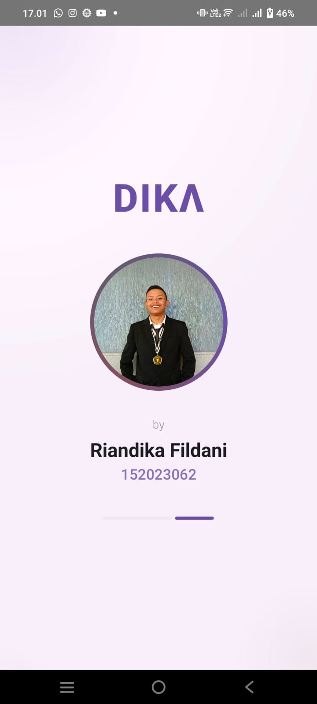
</p>

Splash screen aplikasi DIKA menampilkan animasi typing effect pada nama aplikasi, foto profil dengan efek bounce, serta nama dan NRP pengguna secara elegan di tengah layar. Latar dilengkapi gradient background lembut dengan elemen dekoratif floating yang memberi kesan dinamis dan modern. Setelah animasi berjalan selama 5 detik, tampilan otomatis berpindah ke halaman Dashboard utama.

---

### Fragment Berita
<p align="center">
  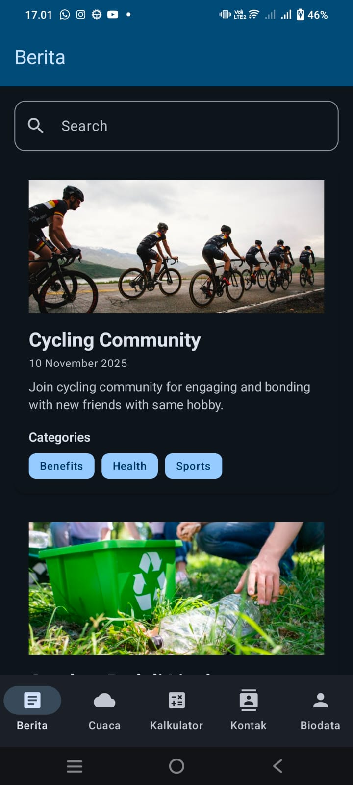
  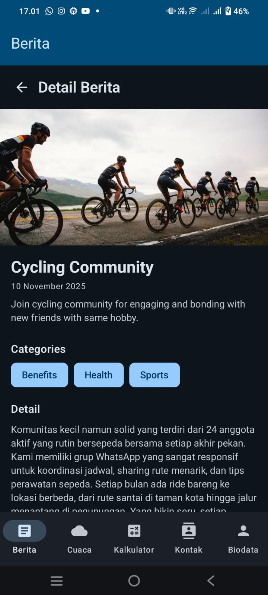
</p>

Fragment Berita berfungsi menampilkan informasi atau artikel terkini secara terstruktur dan interaktif.
Pada gambar kiri, ditampilkan daftar berita (list view) yang memuat thumbnail gambar, judul berita, tanggal publikasi, preview isi berita, serta kategori dalam bentuk tag seperti Benefits, Health, dan Sports. Tersedia juga kolom pencarian di bagian atas untuk memudahkan pengguna menemukan berita sesuai kata kunci.
Sedangkan gambar kanan memperlihatkan halaman detail berita, yang menampilkan gambar utama, judul lengkap, tanggal, kategori, dan isi berita secara penuh. Tampilan ini memberikan pengalaman membaca yang nyaman dan informatif setelah pengguna memilih salah satu berita dari daftar.

---

### Fragment Cuaca
<p align="center">
  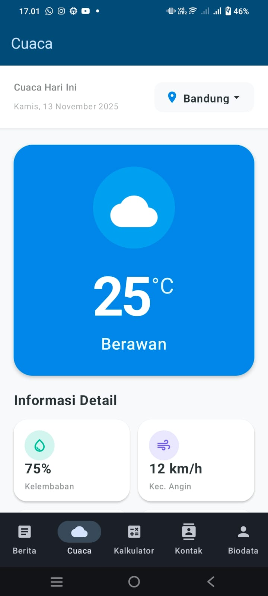
  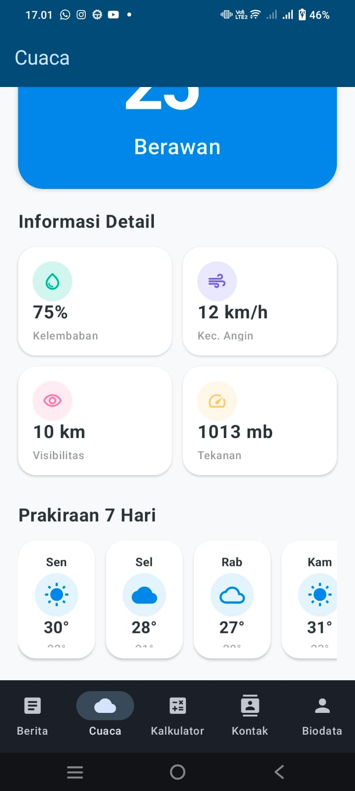
</p>

Fragment Cuaca menampilkan informasi kondisi cuaca terkini secara real-time dengan tampilan visual yang informatif dan modern.
Pada gambar kiri, ditampilkan kondisi cuaca hari ini yang mencakup ikon cuaca, suhu utama (°C), serta deskripsi singkat seperti “Berawan”. Di bawahnya terdapat bagian Informasi Detail yang menampilkan kelembaban udara (humidity) dan kecepatan angin (wind speed).
Sedangkan gambar kanan menampilkan tampilan lanjutan dengan tambahan informasi seperti jarak pandang (visibility), tekanan udara (pressure), serta prakiraan cuaca 7 hari ke depan yang disajikan dalam bentuk kartu harian. Desain menggunakan gaya gradient lembut untuk memberikan kesan bersih, dinamis, dan mudah dipahami oleh pengguna.

---

### Fragment Kalkulator
<p align="center">
  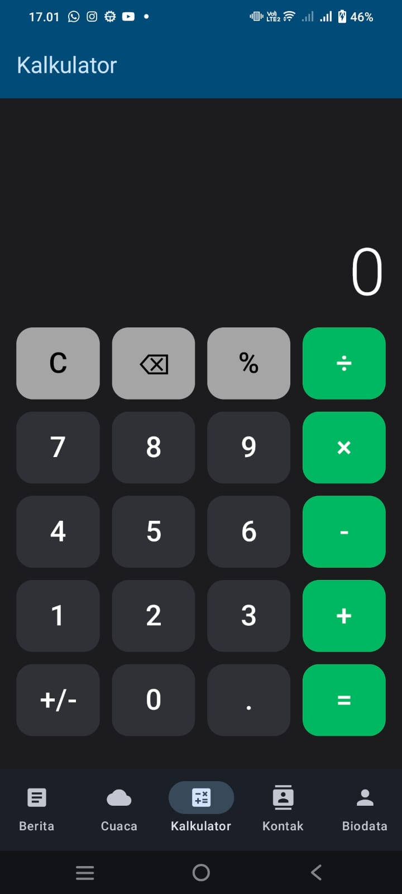
  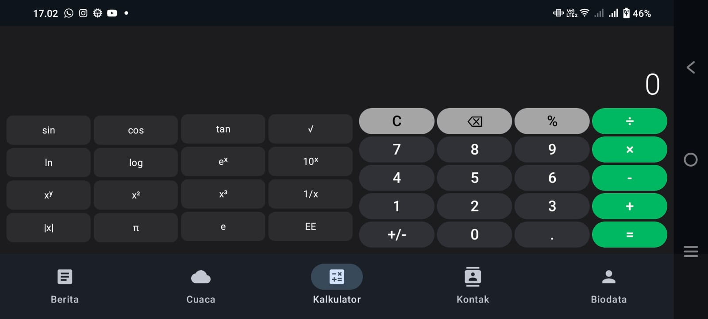
</p>

Fragment Kalkulator berfungsi sebagai alat hitung multifungsi dengan tampilan yang responsif dan mudah digunakan.
Pada gambar kiri, ditampilkan kalkulator dalam mode potrait, dengan tata letak tombol yang besar, kontras warna yang jelas, serta susunan operasi dasar seperti penjumlahan, pengurangan, perkalian, dan pembagian sehingga mudah dioperasikan oleh pengguna.
Sementara pada gambar kanan, ditampilkan mode landscape yang secara otomatis menyesuaikan tampilan menjadi lebih lebar dan menampilkan fitur operasi lanjutan seperti sin, cos, tan, log, dan pangkat, sehingga mendukung kebutuhan perhitungan yang lebih kompleks dengan desain antarmuka yang tetap rapi dan interaktif.

---

### Fragment Kontak
<p align="center">
  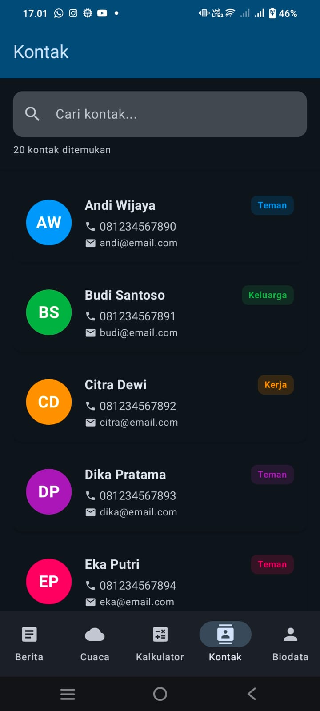
  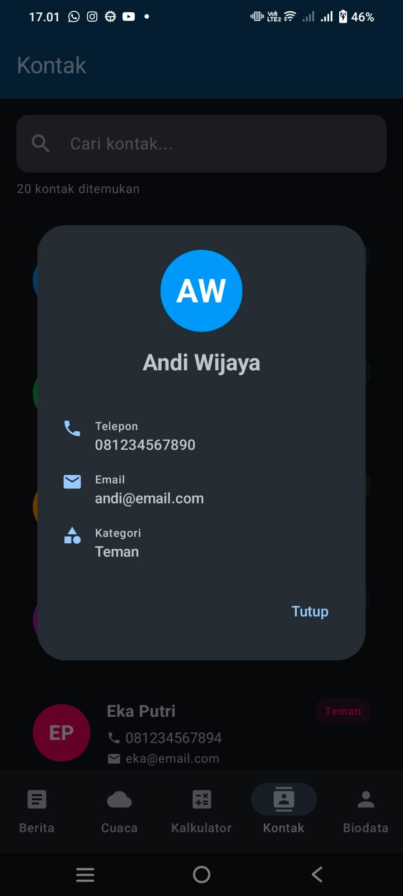
</p>

Fragment Kontak berfungsi sebagai halaman untuk menampilkan dan mengelola daftar kontak pengguna dengan tampilan yang sederhana dan informatif.
Pada gambar kiri, ditampilkan daftar kontak lengkap dengan foto profil, nama, nomor telepon, email, serta status seperti Teman, Keluarga, atau Kerja. Di bagian atas terdapat kolom pencarian yang memudahkan pengguna menemukan kontak tertentu dengan cepat.
Sementara pada gambar kanan, ketika salah satu kontak dipilih, muncul tampilan detail kontak yang menampilkan informasi lebih lengkap seperti foto profil, nama, nomor telepon, email, dan kategori/status kontak. Desain antarmuka dibuat responsif dan mudah dipahami, sehingga pengguna dapat mengakses informasi kontak dengan praktis dan efisien.

---

### Fragment Biodata
<p align="center">
  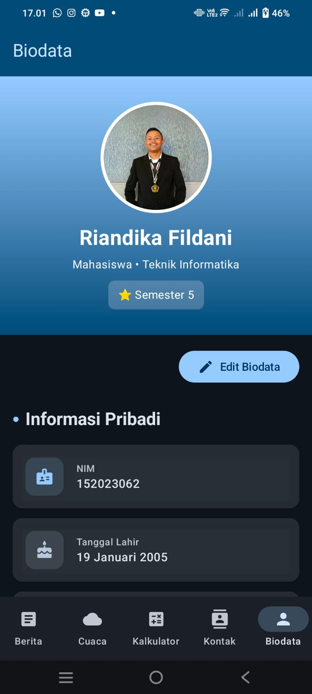
  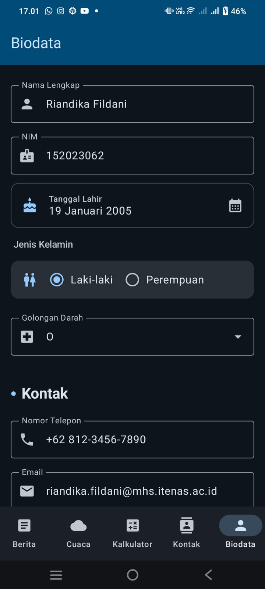
</p>

Fragment Biodata berfungsi untuk menampilkan dan mengelola informasi pribadi pengguna secara lengkap dengan tampilan yang rapi dan interaktif.
Pada gambar kiri, ditampilkan mode view yang memuat card informasi biodata berisi foto profil, nama, program studi, semester, serta data pribadi seperti NIM dan tanggal lahir. Tampilan ini juga dilengkapi dengan tombol Edit Biodata yang memungkinkan pengguna masuk ke mode pengeditan.
Sementara pada gambar kanan, ditampilkan mode edit dengan form input yang lebih lengkap untuk memperbarui data biodata. Pengguna dapat mengubah informasi seperti nama lengkap, NIM, tanggal lahir, jenis kelamin, golongan darah, nomor telepon, dan email. Desain antarmuka dibuat responsif, memudahkan pengguna dalam melihat maupun memperbarui data pribadi dengan tampilan yang bersih dan terstruktur.

---

## �🛠️ Teknologi yang Digunakan

### Framework & Library
- **Kotlin** - Bahasa pemrograman utama
- **Jetpack Compose** - Modern UI toolkit untuk Android
- **Material Design 3** - Design system terbaru dari Google
- **Compose BOM** - Bill of Materials untuk sinkronisasi versi Compose
- **Fragment KTX** - AndroidX Fragment library

### Build Configuration
- **Android Gradle Plugin** - Build automation
- **Min SDK:** 24 (Android 7.0 Nougat)
- **Target SDK:** 36 (Android 15)
- **Compile SDK:** 36
- **Java Version:** 11

### UI Components
- LazyColumn untuk efficient scrolling
- Material3 components (Card, Button, TextField, etc.)
- Custom animations (typing effect, floating, scale, fade)
- Responsive layouts with Modifier
- Vector icons dari Material Icons

---

## 📂 Struktur Folder

```
app/src/main/
├── java/com/example/utsdika/
│   ├── MainActivity.kt                 # Splash Screen Activity
│   ├── DashboardActivity.kt            # Main Dashboard dengan Bottom Nav
│   ├── berita/
│   │   └── BeritaFragment.kt           # Fragment untuk berita
│   ├── cuaca/
│   │   └── CuacaFragment.kt            # Fragment untuk cuaca
│   ├── kalkulator/
│   │   └── CalculatorFragment.kt       # Fragment untuk kalkulator
│   ├── kontak/
│   │   └── KontakFragment.kt           # Fragment untuk kontak
│   ├── biodata/
│   │   └── BiodataFragment.kt          # Fragment untuk biodata
│   └── ui/theme/
│       ├── Color.kt                    # Definisi warna tema
│       ├── Theme.kt                    # Konfigurasi tema Material3
│       └── Type.kt                     # Typography settings
├── res/
│   ├── drawable/                       # Asset gambar (img.png, img_1.png, dll)
│   ├── mipmap/                         # App icons
│   ├── values/
│   │   ├── strings.xml                 # String resources
│   │   └── themes.xml                  # XML theme definitions
│   └── xml/
│       └── data_extraction_rules.xml
└── AndroidManifest.xml                 # App manifest
```

---

## 🚀 Cara Menjalankan Aplikasi

### Prerequisites
- Android Studio Hedgehog | 2023.1.1 atau lebih baru
- JDK 11 atau lebih baru
- Android SDK dengan API Level 24 atau lebih tinggi
- Emulator atau perangkat Android fisik

### Langkah Instalasi

1. **Clone atau Download Repository**
   ```bash
   git clone https://github.com/Masdika1/UTS_PPemrograman-Mobile_AA.git
   cd UTSdika
   ```

2. **Buka Project di Android Studio**
   - Buka Android Studio
   - Pilih `File > Open`
   - Navigate ke folder project `UTSdika`
   - Klik `OK`

3. **Sync Gradle**
   - Android Studio akan otomatis melakukan Gradle sync
   - Tunggu hingga proses selesai
   - Pastikan tidak ada error

4. **Run Aplikasi**
   - Pilih emulator atau connect perangkat Android
   - Klik tombol `Run` (▶️) atau tekan `Shift + F10`
   - Tunggu build process selesai
   - Aplikasi akan terbuka di emulator/device

### Troubleshooting
- Jika terjadi error Gradle sync, coba `File > Invalidate Caches / Restart`
- Pastikan internet tersedia untuk download dependencies
- Update Android Studio ke versi terbaru jika ada masalah kompatibilitas

---

## 🎨 Design Highlights

### Color Scheme
- Primary: Gradient dari purple ke pink
- Secondary: Blue accent
- Background: White dengan subtle gradient
- Card: Elevated dengan shadow

### Animations
- **Typing Effect** pada splash screen
- **Cursor Blinking** animation
- **Scale & Bounce** untuk foto profil
- **Floating** animation untuk elemen dekoratif
- **Fade In/Out** untuk transisi
- **Smooth scroll** pada semua list

### Typography
- Font: Default system font (Roboto)
- Title: Bold, 24-32 sp
- Body: Regular, 14-16 sp
- Caption: Light, 12 sp

---

## 📋 Fitur Tambahan

### Responsive Design
✅ Support orientasi portrait dan landscape  
✅ Adaptive layout berdasarkan ukuran layar  
✅ Top App Bar disembunyikan di mode landscape untuk maksimalkan ruang

### User Experience
✅ Smooth animations dan transitions  
✅ Loading states untuk simulasi proses  
✅ Error handling dengan snackbar/toast  
✅ Form validation di Fragment Biodata  
✅ Search functionality di Fragment Berita dan Kontak

### Code Quality
✅ Clean code dengan proper naming convention  
✅ Separation of concerns (UI, Data, Logic)  
✅ Reusable composable functions  
✅ State management dengan remember dan mutableStateOf  
✅ Comments untuk penjelasan code kompleks

---

## 👨‍💻 Developer

**Riandika Fildani**  
- NIM: 152023062
- Program Studi: Teknik Informatika
- Universitas: Institut Teknologi Nasional Bandung
- Email: riandika.fildani@mhs.itenas.ac.id
- GitHub: [@Masdika1](https://github.com/Masdika1)

---


## 📝 Catatan Pengembangan

### Version 1.0 (November 2025)
- ✅ Implementasi Splash Screen dengan animasi
- ✅ Dashboard dengan Bottom Navigation
- ✅ Fragment Berita dengan search dan detail
- ✅ Fragment Cuaca dengan prakiraan mingguan
- ✅ Fragment Kalkulator fungsional
- ✅ Fragment Kontak dengan search dan detail
- ✅ Fragment Biodata dengan mode View dan Edit
- ✅ Responsive design untuk portrait dan landscape
- ✅ Material Design 3 implementation

### Future Improvements
- [ ] Integrasi dengan API cuaca real-time
- [ ] Database local dengan Room untuk menyimpan data
- [ ] Share functionality untuk berita
- [ ] Dark mode support
- [ ] Localization (multi-bahasa)
- [ ] Unit testing dan UI testing

